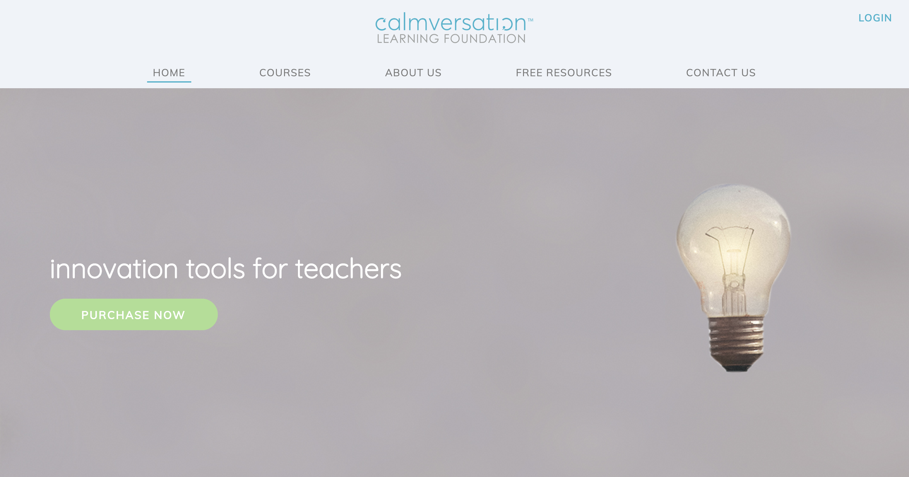
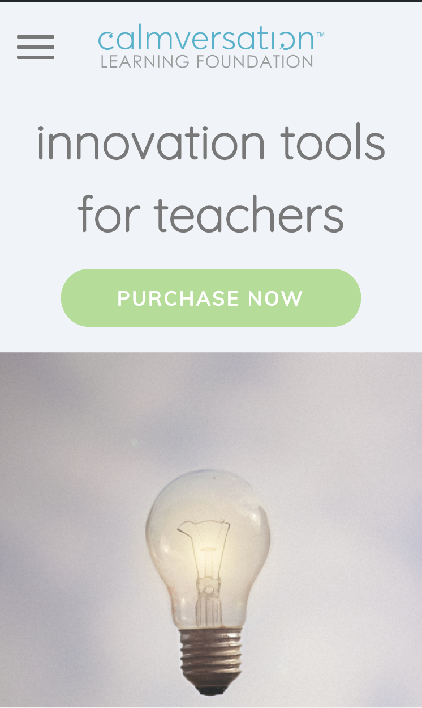

# Calmversation ™

**"** _calmversation is a model for learning that bridges the gap for understanding.
It creates a dynamic social, emotional learning environment and facilitates communication between two people,
whether it is teacher and student, employer and employee, or vendor and client._ **"** - Calmversation.com

This website was designed by RED Academy UX / UI team and brought to life by the Web developers of  RED Academy. 

## Setup

**Install dependencies:**

`> npm i`

**Run locally with Gulp:**

`> npx gulp`

**flickity Carousel:** 

`> npm install flickity`

## screenshots

#### Desktop

#### Mobile

## technologies used

* css
* javascript
* jquery
    * flickity
* sass
* wordpress
    * post types
    * custom field types
    * plugins
    
## Created By

UX/UI Design Team:

* John Kwan
* Jocelyn Cho
* Winnie Dai
* Timothy Chan

Web Developers:

* Jennifer Yiu
* Nikki Wu
* Victor Guo
* Felix Xu

 